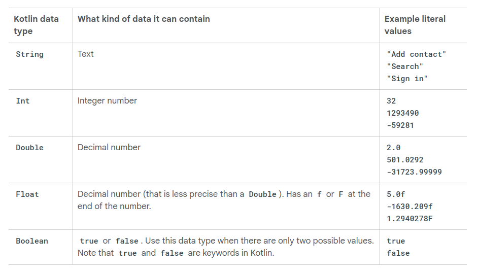

# Basic data types



# Type inference

Type inference is when the Kotlin compiler can infer (or determine) what data type a variable should be, without the type being explicitly written in the code.

```
val edad = 2 // edad takes the type of initial value
val edad:Int = 2
```

This expressions are equavalent to the compiler
